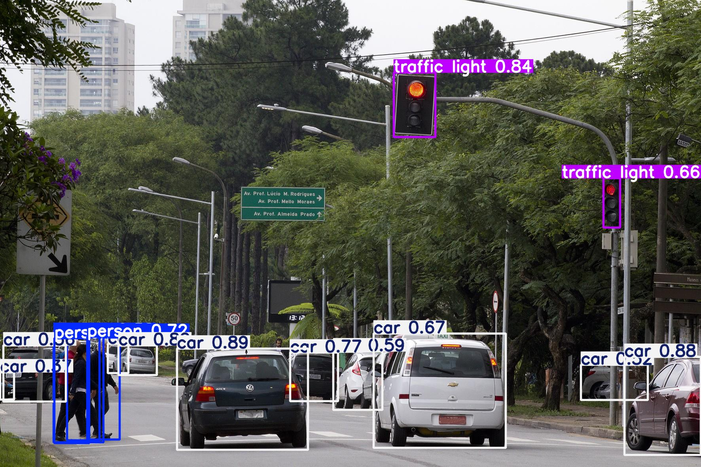

# Detecção de Objetos com YOLOv8 em Ambiente Kaggle

Este projeto demonstra o processo completo de treinamento e aplicação de um modelo de detecção de objetos **YOLOv8** para identificar pessoas, carros e semáforos em imagens de rua. O desenvolvimento foi realizado inteiramente na plataforma Kaggle, aproveitando seus recursos de GPU.

Este trabalho foi desenvolvido como parte de um desafio de projeto para o bootcamp Machine Learning Training da DIO em parceria com a empresa Baires Dev.

## Resultado Final

A imagem abaixo exibe o modelo treinado em ação, aplicando caixas delimitadoras (bounding boxes) e rótulos de classe com seus respectivos níveis de confiança nos objetos detectados.



## Tecnologias Utilizadas
* **Python 3**
* **YOLOv8 (Ultralytics)**: Framework de detecção de objetos.
* **PyTorch**: Biblioteca de Machine Learning usada como backend do YOLOv8.
* **Kaggle Notebooks**: Ambiente de desenvolvimento baseado em nuvem com acesso a GPUs.
* **YAML**: Utilizado para a configuração do dataset.
* **Git & GitHub**: Para versionamento e apresentação do projeto.

## O Papel do Arquivo de Configuração YAML (`.yaml`)
O framework YOLOv8 requer um arquivo de configuração `.yaml` para entender a estrutura do nosso conjunto de dados. Ele funciona como um "mapa" que informa ao script de treinamento três coisas essenciais:
1.  **Onde** estão as imagens de treino e validação (`path`, `train`, `val`).
2.  **Quantas** classes de objetos existem (`nc`).
3.  **Quais** são os nomes de cada classe (`names`).

Neste projeto, foi necessário criar este arquivo manualmente, pois o dataset utilizado no Kaggle não o fornecia, o que foi um passo crucial para o sucesso do treinamento.

## Como Executar o Projeto

Para replicar os resultados, siga os passos abaixo:

**1. Clone o Repositório**
```bash
git clone https://github.com/JohnnyPassos/DeteccaoRedeYolov8.git
cd DeteccaoRedeYolov8
```

**2. (Opcional, mas recomendado) Crie um Ambiente Virtual**
```bash
python -m venv venv
source venv/bin/activate  # No Windows: venv\Scripts\activate
```

**3. Instale as Dependências**
```bash
pip install -r requirements.txt
```

**4. Execute o Notebook**
Abra o arquivo deteccaoredeyolov8.ipynb em um ambiente como Jupyter Notebook, Jupyter Lab ou Visual Studio Code para ver todo o processo, desde a configuração do ambiente até a inferência com o modelo treinado. O modelo (`best.pt`) já está pronto para uso.
